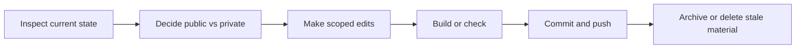

Coding agents are most useful when they are treated as local engineering operators, not as invisible magic. The working model is simple: keep the repository readable, keep the task bounded, and make every external action auditable.

## Where agents help

- reading unfamiliar code and summarizing the actual shape of the system
- making small, scoped edits across multiple files
- running repeatable checks after a change
- turning scattered notes into durable documentation
- preparing migrations, cleanup passes, and repository maintenance

## Boundaries

An agent should not become the owner of ambiguous product direction. It can propose, inspect, implement, and verify, but the repository still needs clear human intent.

Useful boundaries:

- keep destructive actions explicit
- keep private material out of public repositories
- prefer small commits with clear messages
- run local checks before pushing
- write down why a cleanup happened, not only what changed

## Repository hygiene loop

## Practical checklist

- Is the repository still useful to another reader?
- Does the README explain the purpose without private context?
- Are old experiments archived instead of left public by accident?
- Can new writing be added with Markdown instead of code changes?
- Is the public profile pointing to the best maintained material?

This is the operating rule for this account: public surfaces should explain current work; private archives should preserve history without becoming noise.
