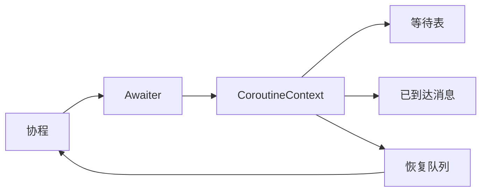

这篇笔记来自旧内容整理，中文版本先保留核心模型，后续再展开代码细节。

## 目标

构建一个轻量的消息驱动异步调度器：

- 协程可以用 `co_await` 等待某个消息 key。
- 消息到达后恢复等待该 key 的协程。
- 消息可以乱序到达。
- 使用队列调度恢复动作，避免嵌套 `resume()`。
- 每个线程拥有自己的 `CoroutineContext`。
- 异常通过 `std::exception_ptr` 捕获。
- 历史消息需要显式清理。

## 核心模型

## 关键判断

这个例子的价值不在于成为生产运行时，而是说明一个形状：

- 异步依赖可以表达为 awaiter。
- 挂起的 coroutine handle 可以按 key 存储。
- 恢复动作进入队列，避免深层递归恢复。
- 上下文所有权必须清晰。

英文详细版见同名英文页面。
