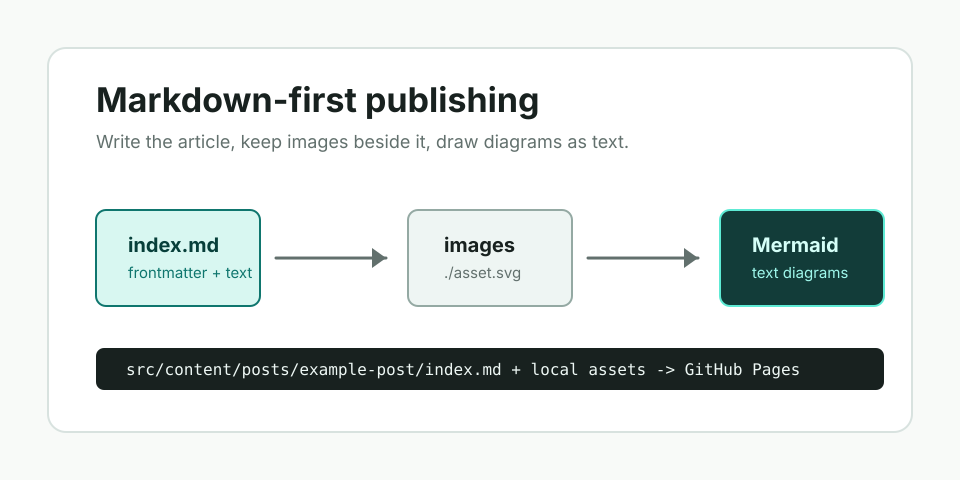
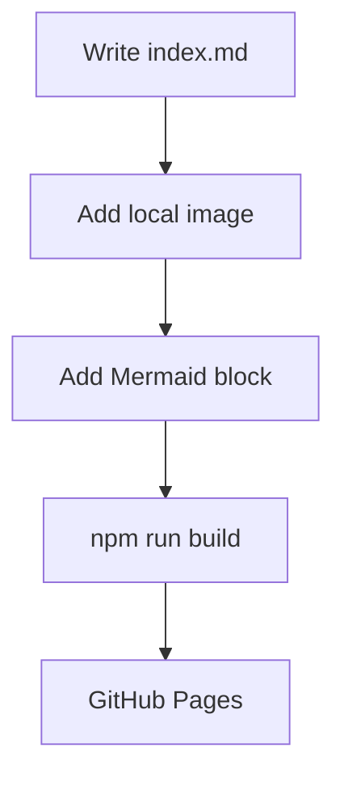

This note checks the writing path I want to use long term: one Markdown file, local assets in the same folder, and diagrams written as text.

## Local image

The image below is referenced with a relative Markdown path:

```md

```


## Mermaid diagram

The diagram below is written directly in Markdown:



If both the image and the diagram render, future posts can stay content-only.
