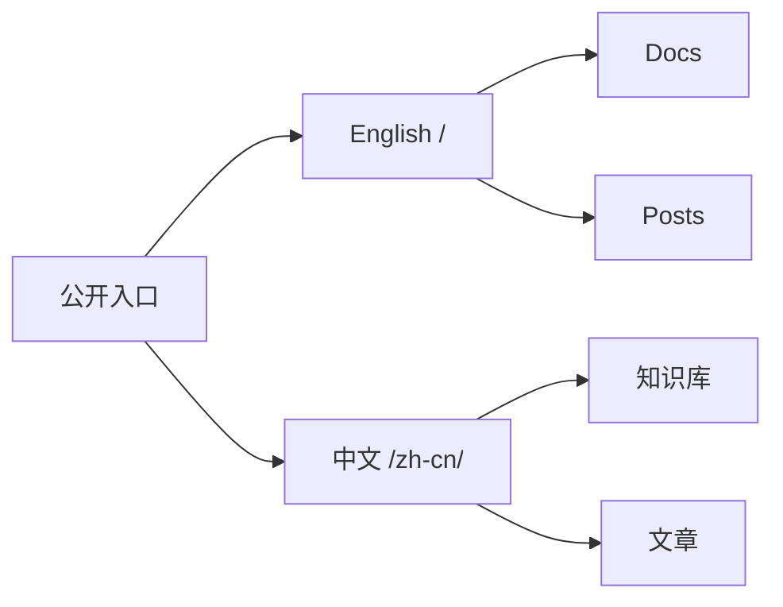

这次重构的目标不是增加更多页面，而是让公开内容更容易长期维护。

## 新结构

- 英文内容保留在根路径。
- 中文内容放在 `/zh-cn/`。
- 知识库页面承载长期维护内容。
- 文章页面记录按时间发生的过程。
- RSS、标签和归档按语言分开。

## 维护原则

双语站点最容易失败的地方是把两种语言混在同一页里。更干净的做法是让每个 URL 只服务一种语言。

不是每篇文章都需要双语版本。核心入口页需要双语维护，普通文章可以按自然语言写作。
